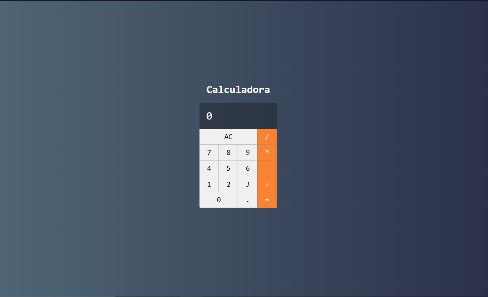

<h1>Projeto React-Calculator.</h1>

O objetivo desse projeto é testar/mostrar de maneira prática meu conhecimento com ReactJS.

<h1>Baixar depêndencias:</h1>

Rode <code>npm i</code> no terminal.

<h1>Rodar projeto:</h1>

Apenas rode <code>npm start</code> e navegue até `localhost:3000` no browser.
